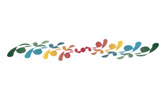

```{r setup, include=FALSE}
knitr::opts_chunk$set(echo = FALSE)

```


# Welcome!

<aside></aside>

<aside> We work on the nexus between, fish, water, fish food, and restoration across Northern California.</aside>
